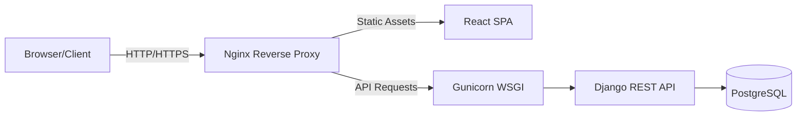

# Architecture Overview

## System Architecture
The application follows a traditional Client-Server architecture utilizing a Single Page Application (SPA) frontend and a RESTful API backend.

## Frontend Architecture
- **State Management**: React Hooks (useState, useEffect, Context API).
- **Routing**: Client-side routing with code-splitting (`React.lazy`). Components below the fold are loaded asynchronously.
- **Styling**: Vanilla CSS with CSS Variables for themes.

## Backend Architecture
- **Layered Design**:
  - **Models**: Defines the DB schema (`Member`, `Event`, `Registration`, etc.).
  - **Serializers**: Transforms complex data to/from JSON.
  - **Views/ViewSets**: Contains the business logic.
  - **URLs**: Routes API requests to the appropriate View.

## Authentication Flow
1. Admin enters credentials on the login page.
2. Frontend POSTs to `/api/token/`.
3. Backend validates and returns an `access` and `refresh` token.
4. Frontend stores tokens in `localStorage` and redirects to the Dashboard.
5. Subsequent API requests include `Authorization: Bearer <token>`.
